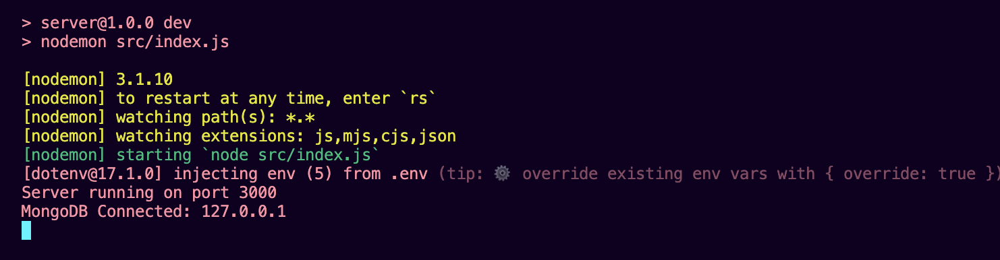
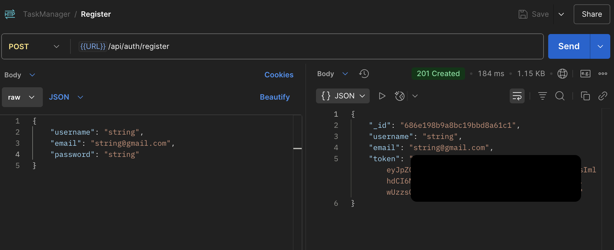
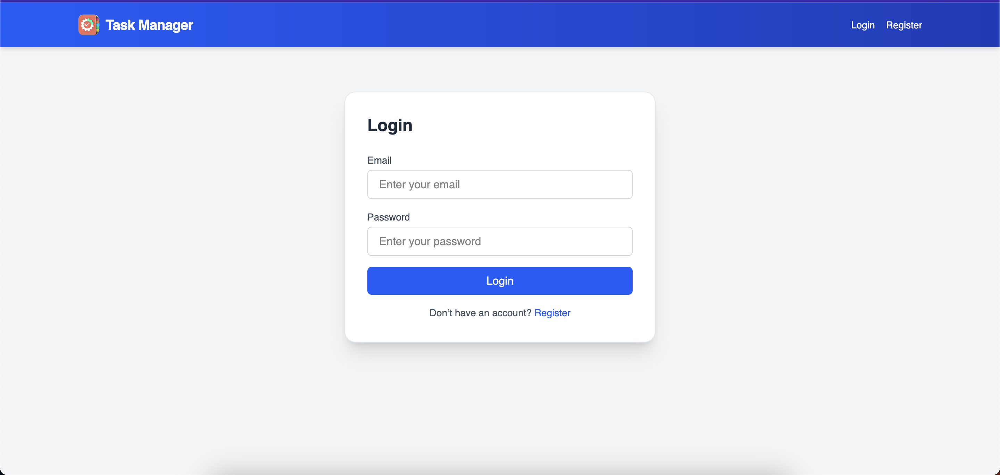

# Task Manager Setup Guide

## Prerequisites

- **Node.js**: Version 18 or higher (tested with v22.17.0)
- **npm**: Version 8 or higher
- **MongoDB**: Local instance or MongoDB Atlas
- **Postman**: For API testing
- **Git**: For cloning the repository

## Installation Steps

### 1. Clone the Repository

```bash
git clone https://github.com/ahad324/task-manager.git
cd task-manager
```

### 2. Backend Setup

Navigate to `server/` directory:

```bash
cd server
```

Install dependencies:

```bash
npm install
```

Create `.env` file with:

```env
MONGO_URI=mongodb://127.0.0.1:27017/task-manager
PORT=3000
NODE_ENV=development
JWT_SECRET=your_jwt_secret_key
```

Start MongoDB (local):

```bash
mongod
```

Start the server:

```bash
npm run dev
```

> **Note**: API runs at http://127.0.0.1:3000/api

---

### 3. Frontend Setup

Navigate to `client/` directory:

```bash
cd client
```

Install dependencies:

```bash
npm install
```

Create `.env` file with:

```env
VITE_API_URL=http://127.0.0.1:3000/api
```

Start the development server:

```bash
npm run dev
```

> **Note**: App runs at http://localhost:5173

---

### 4. Verification

Test API in Postman:

- `POST`

  ```
  http://127.0.0.1:3000/api/auth/register
  ```

  Body:

  ```json
  {
    "username": "testuser",
    "email": "test@example.com",
    "password": "password123"
  }
  ```
- `GET`

  ```
  http://127.0.0.1:3000/api/tasks
  ```

  with **Bearer Token** after login.

Open browser at:
http://localhost:5173 to verify frontend is working.

---

### Screenshots

#### ✅ Server Started Successfully


#### 📫 Postman API Test


#### 🧑‍💻 Frontend Login Page



---

### Troubleshooting

- Ensure MongoDB is running.
- Check `.env` files for correct `MONGO_URI` and `JWT_SECRET`.
- Verify port availability (default: `3000` for backend, `5173` for frontend).

---

### 5. API Documentation

The API documentation is auto-generated from `API_Documentation.yaml` (based on OpenAPI spec) and is available once the server is running.

📄 **View it in your browser at**:
[http://127.0.0.1:3000/api/docs](http://127.0.0.1:3000/api/docs)

If you're looking for the raw file:

- **Location**: `server/docs/API_Documentation.yaml`
