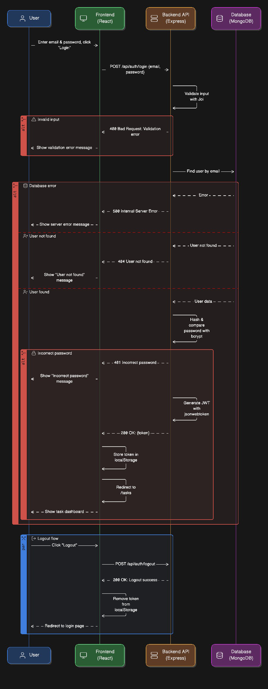
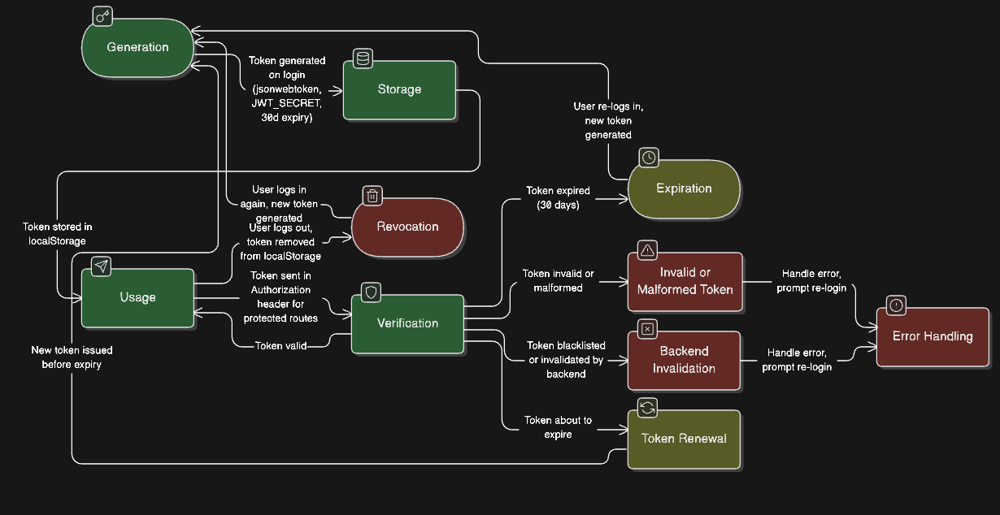
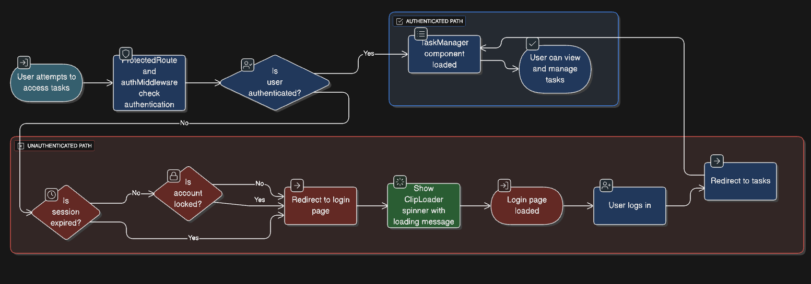

# Technical Specifications

## JWT Implementation

- **Library**: `jsonwebtoken` (v9.0.2)
- **Token Generation**: `generateToken` in `authController.js` uses `JWT_SECRET` with 30-day expiry.
- **Payload**: Contains `id` (User._id).
- **Verification**: `protect` middleware decodes token and fetches user.

## Middleware Explanation

- **authMiddleware.js**: Extracts Bearer token, verifies with `JWT_SECRET`, attaches `req.user`.
- **errorHandler.js**: Catches and logs errors, returns JSON responses with status codes (400, 401, 500).

## Sequence Diagrams

- Refer to generated diagrams below for visual flows.
  - 
  - 
  - 